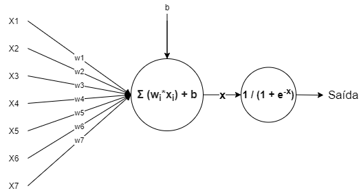

# Aplicação de um mlp classifier para jogar o Dino run da Google



---
para executar o jogo normalmente basta executar o arquivo t-rex-game.py.
```cmd
python arquivo t-rex-game.py
```

o jogo funciona com os direcionais cima e baixo do teclado

---
para executar e vizualizar a IA aprendendo a jogar o jogo basta executar o arquivo t-rex-game_ia.py.
```cmd
python arquivo t-rex-game_ia.py
```
